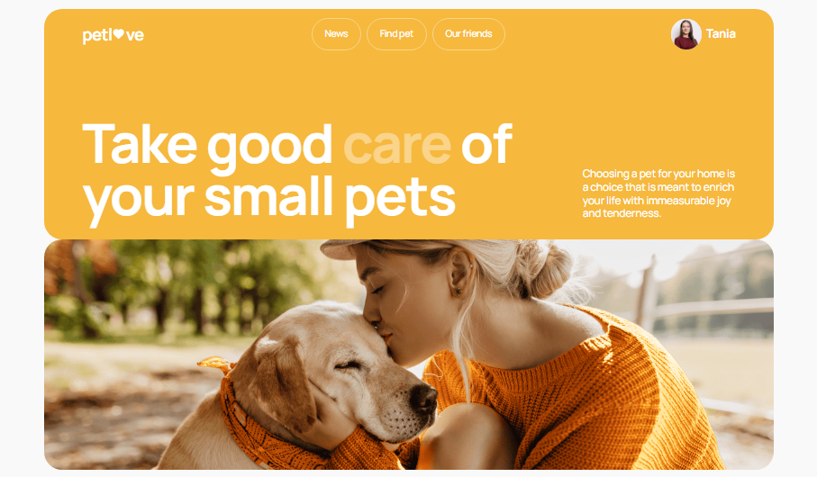

# PetLove

PetLove is an application that helps people find pets, manage their pets, and connect with other pet owners. It allows users to create profiles for their pets, keep up with pet-related news, view announcements about pets, and connect with other users in the pet community.

## Technologies Used

- **React** to build the user interface and manage components efficiently.
- **React Router** for navigation, enabling users to switch between different views seamlessly.
- **React Hook Form and Yup** for form handling and validation, ensuring robust and user-friendly forms.
- **Redux** for state management, providing a centralized store for user and pet data, facilitating efficient data management.
- **Redux Persist** to persist the Redux store data to the browser's local storage, ensuring a visually appealing and maintainable design.
- **Styled components** for styling the application, ensuring a visually appealing design.
- **Responsive design** adapting to different screen sizes, providing a seamless user experience on mobile, tablet, and desktop devices.

## Layout

The application layout includes four main pages: "Home", "News", "Find pet", and "Our friends". The app also features Registration and Login pages for authentication.

### Public Pages

- **Home**: This page will appear first when you load the app and if the user logs out from their profile. It contains the main title with a hero image.
- **News**: Page with a list of news about animals and pets, with a search bar and pagination. Clicking "Read more" will open the news resource in a new browser tab.
- **Find pet**: Page with a list of existing pets, with pagination and a search-filter bar where users can filter the list of animals by various parameters like type, gender, location, price, popularity, species, and keyword.
- **Our friends**: Page with a list of companies contacts that help our pets a lot.
- **Registration page**: Page with a form for registering a new user.
- **Login page**: Page for logging in a user to the app.
- **404 page**: If there is an incorrect URL, the user is redirected to the 404 page. This page has a button to go to the Home page.

### Private Pages

- **Profile**: Page with information about the user, including a list of the user's pets, and a list of favorite and viewed pets. On this page, users can change their avatar and other information about themselves. To create a new pet, users can go to the Add-pet page.
- **Add-pet**: Page with a form for creating a new pet for the current user.



## Getting Started

### Installation

1. Clone this repository.

```bash
git clone https://github.com/TaniaUdod/pet-love.git
```

2. Install dependencies.

```bash
npm install
```

3. Run the application.

```bash
npm start
```

The application will run on http://localhost:3000/.

### Accessing the Application Online

If you want to access the application online, you can visit
https://taniaudod.github.io/pet-love/.
